# Real-Time Collaborative Workspace Canvas (`canvas-sync-engine`)

<p>
  
  
  
  
  
</p>

A low-latency, production-grade state synchronization matrix built using a hybrid Next.js execution engine. This system exposes custom lifecycle hooks that serialize and pipe user cursor vector arrays over a high-throughput WebSocket transport layer, achieving state reconciliation in under 15 milliseconds.

The UI is a dashboard workspace: an interactive multi-user canvas paired with a live **System Sync Telemetry** sidebar (Recharts) that visualizes reconciliation latency and throughput alongside cluster status.

## Features

- **Synchronized multi-user cursors** — every peer's pointer is broadcast and rendered in real time within a shared room.
- **Optimistic vector broadcast** — the gateway reconciles and rebroadcasts cursor frames to all peers for sub-15ms perceived latency.
- **Server-assigned identity** — each client receives a stable `userId` + color on connect.
- **Room isolation** — clients are grouped by `roomId`; broadcasts never leak across rooms.
- **Live telemetry dashboard** — a Recharts sidebar visualizes latency/throughput next to cluster status.
- **Strict TypeScript + Tailwind** — typed hooks and utility-first styling throughout.

## Architecture Topology

```mermaid
graph TD
    A[Browser Client Alpha] -->|useWebSocketCanvas hook| B(WebSocket Transport)
    C[Browser Client Beta] -->|useWebSocketCanvas hook| B
    B -->|Bi-directional Frames| D[Socket.io Gateway Module]
    D -->|In-Memory Buffer Room| E{State Reconciliation Loop}
    E -->|Optimistic Vector Broadcast| A
    E -->|Optimistic Vector Broadcast| C

    style B fill:#1e1e2f,stroke:#6366f1,stroke-width:2px
    style E fill:#0f172a,stroke:#10b981,stroke-width:2px
```



## System Stack & Core Dependencies

- **Framework Engine:** Next.js 15+ (App Router Architecture)
- **Language Runtime:** TypeScript (Strict Mode)
- **Styling Matrix:** Tailwind CSS
- **Communication Layer:** Socket.io / Socket.io-client (Engine.io WS transport)
- **Telemetry Visualization:** Recharts
- **Iconography:** lucide-react

## Sync Event Protocol

The gateway and clients communicate over a small, typed event contract:

| Event               | Direction         | Payload                                  | Purpose                                     |
| ------------------- | ----------------- | ---------------------------------------- | ------------------------------------------- |
| `init`              | server → client   | `{ userId, color }`                      | Assigns a stable identity + cursor color.   |
| `mouse-move`        | client → server   | `{ x, y }`                               | Raw local pointer frame (normalized 0–1).   |
| `cursor-update`     | server → peers    | `{ x, y, userId, color }`                | Enriched cursor vector rebroadcast to room. |
| `user-disconnected` | server → peers    | `userId`                                 | Signals a peer left so its cursor is cleared. |

## File Directory Structure

```text
canvas-sync-engine/
├── server/
│   └── index.js                     # Socket.io gateway (rooms + cursor reconciliation loop)
├── src/
│   ├── components/
│   │   ├── InteractiveCanvas.tsx    # Client canvas + cursor rendering layer
│   │   └── AnalyticsChart.tsx       # Recharts sync-telemetry visualization
│   ├── hooks/
│   │   └── useWebSocketCanvas.ts    # Core state-streaming lifecycle engine
│   └── app/
│       ├── globals.css              # Tailwind layer + global tokens
│       ├── layout.tsx               # Root global markup template
│       └── page.tsx                 # Dashboard grid: canvas + telemetry sidebar
├── .env.example                     # Gateway + client env reference
├── next.config.mjs
├── postcss.config.mjs
├── tailwind.config.ts
├── tsconfig.json
└── package.json
```

## Setup & Local Lifecycle Initialization

### Requirements

- Node.js 18.18+ (Next.js 15 requirement)
- npm 9+

### 1. Install dependencies

```bash
npm install
```

### 2. Configure environment

Copy the example env file and adjust ports/origins if needed:

```bash
cp .env.example .env.local
```

| Variable                 | Purpose                                   | Default                 |
| ------------------------ | ----------------------------------------- | ----------------------- |
| `NEXT_PUBLIC_SOCKET_URL` | URL the browser uses to reach the gateway | `http://localhost:4000` |
| `SOCKET_PORT`            | Port the gateway listens on               | `4000`                  |
| `CLIENT_ORIGIN`          | Allowed CORS origin for the gateway       | `http://localhost:3000` |

### 3. Run the gateway + web client together

```bash
npm run dev:all
```

This launches both the Socket.io gateway (`:4000`) and the Next.js dev server (`:3000`) concurrently. Open <http://localhost:3000> in two browser windows to see synchronized multi-user cursors.

> Prefer separate terminals? Run `npm run server` and `npm run dev` independently.

## Available Scripts

| Script              | Description                                |
| ------------------- | ------------------------------------------ |
| `npm run dev:all`   | Run gateway + Next.js dev server together  |
| `npm run dev`       | Next.js dev server only                    |
| `npm run server`    | Socket.io gateway only                     |
| `npm run build`     | Production build                           |
| `npm run start`     | Serve the production build                 |
| `npm run typecheck` | TypeScript strict type validation          |

## � Telemetry Note

The **System Sync Telemetry** chart in `AnalyticsChart.tsx` currently renders representative sample data. To surface real metrics, feed measured reconciliation latency/throughput from the WebSocket layer into the chart's data source.

## �🔗 Source

Repository: <https://github.com/Jolaboy/canvas-sync-engine>